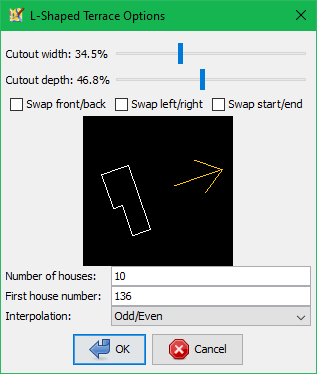

# JOSM L-Shaped Terrace Plugin

Plugin for the JOSM OpenStreetMap editor. Turns a closed rectangular way into a row of L-shaped buildings.

## Installing

Put the .jar file in your JOSM plugins directory. Start JOSM and the *L-Shaped Terrace* option should be available in the *More tools* menu.

## Using

1. Draw a rectangular outline (with 4 nodes) for the block of houses.
2. Tag it with building type, street name, etc. The plugin will copy these tags to each house.
3. Make sure the outline is selected.
4. Optionally, also select an L-shaped way (with 6 nodes) to serve as a template. Its proportions will be used to set the default cutout size and number of houses in the plugin dialog. This way will not be modified or deleted by the plugin.

5. Run the plugin from the *L-Shaped Terrace* option in the *More tools* menu.

6. Amend the cutout size, orientation and number of houses to suit. The dialog provides a preview of the shape and orientation of the first house, and an arrow indicating the direction in which terracing and numbering will continue.
7. For a terrace of normal rectangular buildings, set either cutout dimension to zero.
8. If numbering is required, provide the first house number and interpolation type.
9. Click OK.
10. The outline will be replaced with a terrace of L-shaped buildings.

11. Now you can make any adjustments for house extensions etc, and delete the template way if necessary.

## Building

Builds with Apache Ant, as per the [JOSM plugin developers' guide](https://josm.openstreetmap.de/wiki/DevelopersGuide/DevelopingPlugins).

Add the contents of this repo to your JOSM source tree at `josm/plugins/LShapedTerrace/`

## Known Issues

I haven't yet submitted this plugin to the official repos or plugin list (though I have cheekily put it within the `org.openstreetmap.josm.plugins` namespace in anticipation thereof) because:

- This is my first attempt at JOSM plugin dev, and I'm not yet confident that it won't trash anyone's hard work.

- I need to write some regression tests for the geometry stuff.

- It's currently English-only, I haven't yet made any provision for i18n.

- This is quite similar to (though not derived from) the existing *Terracer* plugin, and I don't want to step on any toes!

## License

Code is copyright by Tyrone C. and made available under the GPL v2, the text of which can be found in the `LICENSE` file in this repository.
